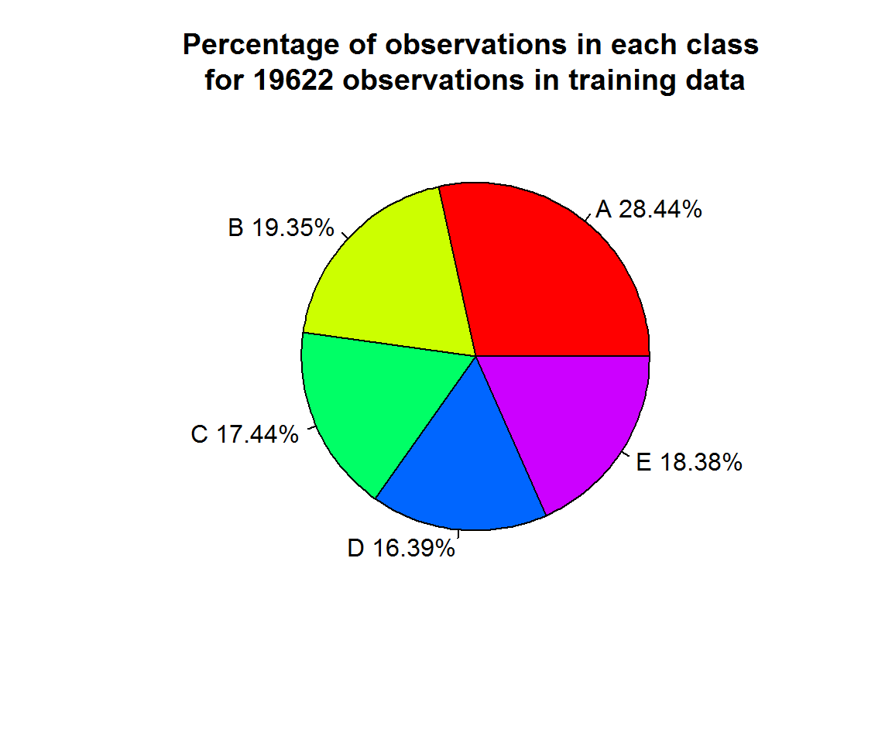

# Project Write-Up
Yogesh PARTE  
Friday, May 22, 2015  

#Introduction

* The goal of this project is to develop a model to predict *classe* variable for training and testing data provided in files *pml-training.csv* and *pml-testing.csv* respectively. 

* All the steps and analysis carried out for data clean-up, model selection, model creation and prediction are explained in following paragraphs.


#Analysis of the data

1. There are 160 recorded variables in each files. Training data file contains 19622 observations and corresponding to each of these observation the class is listed under variable *classe*. *classe* variable is absent in testing data.

2. Many of the columns are either blank or contain NA values. 

## Cleaning of the data
We remove following variables/ columns from trainig data:

1. Columns with NA values.

2. Columns containing time stamps, user names

3. Columns with derived quantities such as min, max, kurtosis values, etc.,...


## Analysis of cleaned training data

* Cleaned training data contains 52 predictors.

* Number of observations in each of the class are shown in pie chart below. As evident **class-A** is dominant where as other classes have more or less similar number of observations.

 


* There are 52 predictor variables.

* There appears to be strong correlation amongst predictor variable 


#Modeling approach
Considering strong correlation amongst predictor variables and large number of observations, it is decided to use *randomForest* algorithm/function to obtain predictive model. Some of the advantages cited are (see [Ref-2](http://www.stat.berkeley.edu/~breiman/RandomForests/cc_home.htm#overview)):

* It is unexcelled in accuracy among current algorithms.

* It runs efficiently on large data bases.

* It gives estimates of what variables are important in the classification.

* It generates an internal unbiased estimate of the generalization error as the forest building progresses.

* It has methods for balancing error in class population unbalanced data sets.

#Modeling process


```r
library('randomForest')
```

```
## randomForest 4.6-10
## Type rfNews() to see new features/changes/bug fixes.
```

```r
set.seed(899)
rfmodel<-randomForest(trainX,y,ntree=500,importance=TRUE)
```

#Model description and statistics

```
## 
## Call:
##  randomForest(x = trainX, y = y, ntree = 500, importance = TRUE) 
##                Type of random forest: classification
##                      Number of trees: 500
## No. of variables tried at each split: 7
## 
##         OOB estimate of  error rate: 0.29%
## Confusion matrix:
##      A    B    C    D    E  class.error
## A 5578    2    0    0    0 0.0003584229
## B   12 3783    2    0    0 0.0036871214
## C    0   11 3409    2    0 0.0037989480
## D    0    0   20 3194    2 0.0068407960
## E    0    0    0    5 3602 0.0013861935
```

#Comments

1. OOB estimate of  error rate:  0.3%  

2. Class error for class-A is minimal amongst all classes as it is the dominant class. However, class error for other classes is well within acceptable limit of less than 10% 

3. Cross validation is ensured in forest building process which avoids overfitting [Ref-1](http://www.stat.berkeley.edu/~breiman/RandomForests/)

# Model prediction for the test data

*We clean the testing data to retain predictors identical to the training data 


```
##  1  2  3  4  5  6  7  8  9 10 11 12 13 14 15 16 17 18 19 20 
##  B  A  B  A  A  E  D  B  A  A  B  C  B  A  E  E  A  B  B  B 
## Levels: A B C D E
```


#References
1. [Random Forest](http://www.stat.berkeley.edu/~breiman/RandomForests/)
                   
                   
                   


